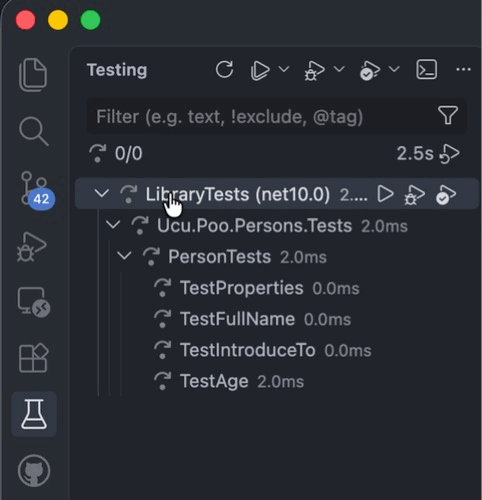

<!-- markdownlint-disable-next-line MD033 MD041 -->

# Universidad Católica del Uruguay

## Programación II

# Debug & Test

Código de ejemplo del tema debug &amp; test.

## Introducción

Este ejemplo usa la clase `Person` que ya conoces de repos anteriores. Agrega la
propiedad `Age` que retorna la edad de una persona al día de hoy.

> [!WARNING]
>
> **El código tiene errores**. El objetivo de esta actividad es justamente que
>uses la funcionalidad de depuración —debug— para encontrar los errores y
>corregirlos.

Para mostrar los errores usamos casos de prueba. Los casos de prueba son
programas que prueban nuestros programas. Todavía no sabes cómo escribir casos
de prueba; por ahora usa los casos de prueba que te damos y luego verás como
escribir tus propios casos de prueba.

Para depurar los casos de prueba, puedes poner un *breakpoint* en el caso de
prueba que quieras depurar y luego:

* Compila la solución; no verás ni podrás ejecutar los casos de prueba si la
  solución no compila. Para ello usa el comando `Run Build Task...` del menú
  `Terminal` y elije `dotnet: build`.

* Mostrar la ventana de casos de prueba con el comando `View` del menú
  `Testing`.

* En la ventana `Testing`, haz clic en el botón `Debug Tests (Default)`.

  

## Objetivo

Depurar la clase `Person` para descubrir donde están los errores y corregirlos.

## Uso de 

Es posible usar GitHub Copilot en este repositorio. Consulta [cómo usar Copilot
para aprender](./COPILOT.md).
